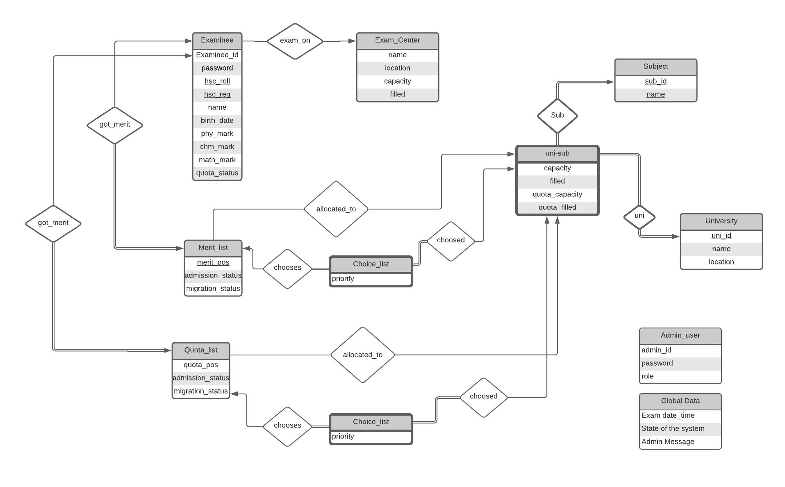

# CSE 216 - Database Project

**Members:**

1805032 - [Mahdee Mushfique Kamal](https://github.com/MahdeeMushfiqueKamal)

1805058 - [Aroma Hoque](https://github.com/aroma058)

## Combined Engineering Admission System

**Types of Users:** 

* Regular Students
* University Admission Committee (For Each University)
* System Admin

**States of the system:**

1. Registration Period
2. Before Exam
3. Exam Result
4. Apply Period
5. Admission Period + migration (Several Times)

The states of the Website will be selected by the system admin. 

**Features:**

* **Registration Period:** Students will register with the HSC roll and registration Number. Will get a login credential after registration. Will see a dashboard after logging in. Students will select an exam center, based on availability. 
* **Before Exam:** Students will be able to see the exam center, examination time and date. 
* **Exam Result:** Students will be able to see marks(Physics, Chemistry, Math) and merit position. They will be notified whether they are available for applying. 
* **Apply Period:** Students will provide a choice of (Subject, University) list. Example: 1:(CSE,BUET), 2:(EEE,BUET), 3:(ME,BUET), 4:(CSE-KUET), 5:(CSE-RUET), 6:(CSE-CUET) 

    Will be disqualified if not applied within time. 

* **Quota System:** There will be Tribal_Hill_Tracts quota, certain departments in every university will have a selected number of quota seats .Those who will be eligible for quota can either submit their choice list for merit position or quota position. 
* **Admission Period:** There will be a date to get admitted onto a varsity. They will submit their papers to the university committee. University will confirm admission.
* Students can stop migration. Students and admitted university both will have to confirm 'stop migration request'.
* **Migration:** There will be migration on certain dates. Migration period and migration control will be at the hands of admins. 

# Entity Relation Diagram

