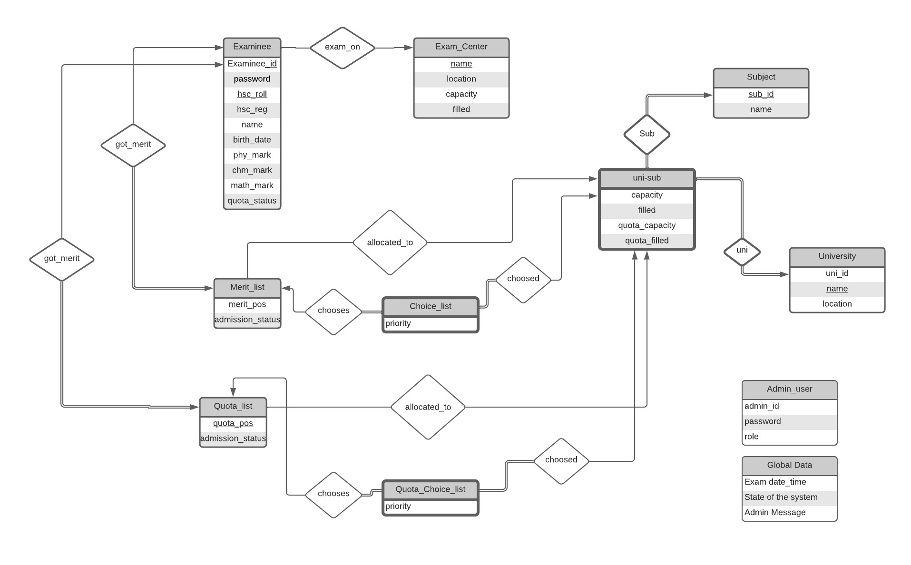

# CSE 216 - Database Project - Combined Engineering Admission System

**Members:**

1805032 - [Mahdee Mushfique Kamal](https://github.com/MahdeeMushfiqueKamal)

1805058 - [Aroma Hoque](https://github.com/aroma058)

## Project Proposal - [Link](Project_Proposal.md)

## Run in your system

1. Installations:

Install Flask and other python dependencies. Download Oracle instant client and set the path like this 
```
elif sys.platform.startswith("win32"):
    cx_Oracle.init_oracle_client(lib_dir=r"C:\instantclient_21_3")
``` 
on app_admin.py and app_user.py

2. User Creation and Connection:

Go to directory "supporting functions"
- Open "0.initial sqls.sql." Follow the instruction to create user C##CEAS_ADMIN and C##CEAS_USER. Grant them appropriate access. 
- Run 1.DDL.sql, 2.populate_table.sql before running the apps and 3.choice_ lists.sql after generating merit list as dummy data. This contains randomly generated data of 32,000 examinee and 50,000 entries in choice list. 
- Add two environment variables, `PYTHON_DB_PASSWORD = 1234`, `'PYTHON_CONNECTSTRING= 127.0.0.1/orcl`. or hardcode values in `start_pool()` function of both app_user.py and app_admin.py on these lines. 
```
pool = cx_Oracle.SessionPool(user="C##CEAS_ADMIN",password=os.environ.get('PYTHON_DB_PASSWORD'),
dsn=os.environ.get('PYTHON_CONNECTSTRING'), min=pool_min,max=pool_max,increment=pool_inc,threaded=True,getmode=pool_gmd,sessionCallback=init_session)
```

3. Run Both Apps: 

- `python "Admin End"/app_admin.py`
- `python "User End"/app_user.py`

# Entity Relation Diagram

